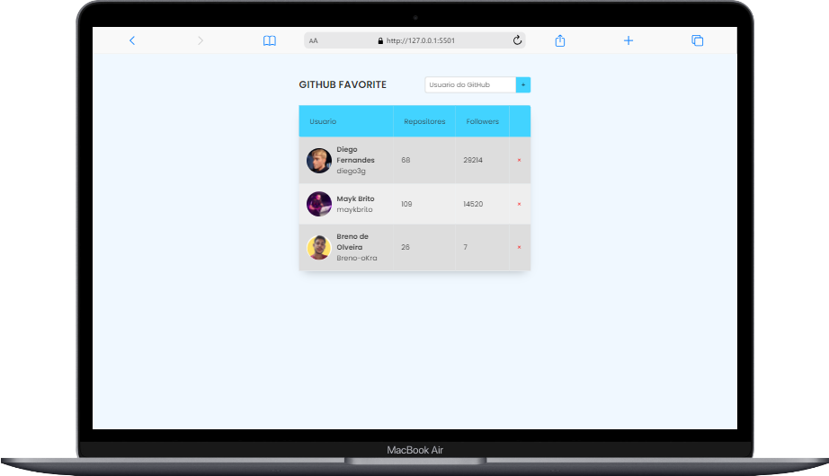

<h1 align="center">Git Favorite
</h1>

## 🚀 Tecnologias

Esse projeto foi desenvolvido com as seguintes tecnologias:

- HTML
- CSS
- JavaScript

## 💻 Projeto

uma pagina simples com a adição de usuarios do github, com visualização de imagem,seguidores e repositorios

## 🎓 Aprendizado

- package.json
- API
- fetch,than, catch, trow new error
- tables
- class
- async e await
- Json.stringify() json.parse()
- localStorage

## ℹ️ sobre
aprimorar os conceitos sobre classes e  aprender a consumir api simples

